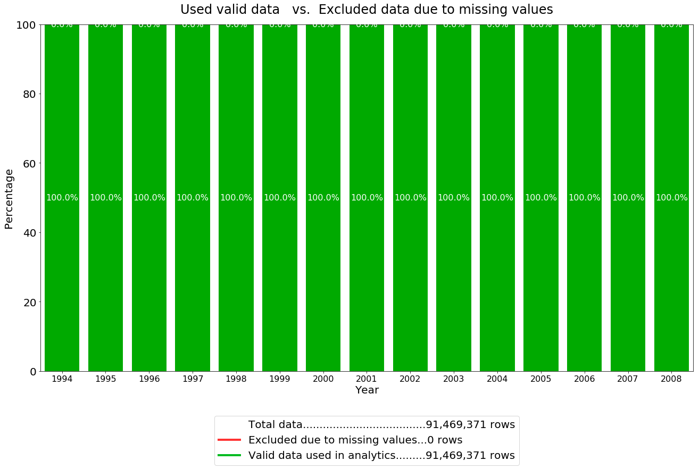
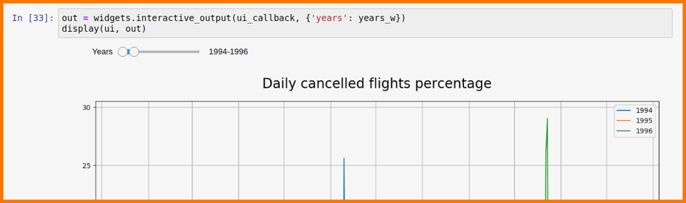
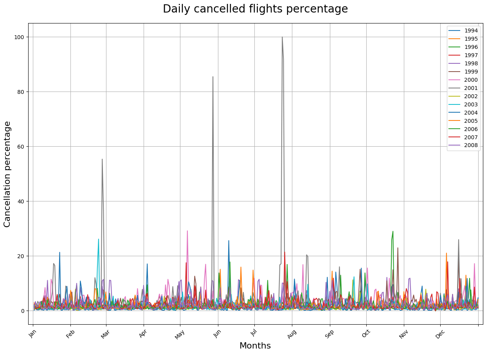
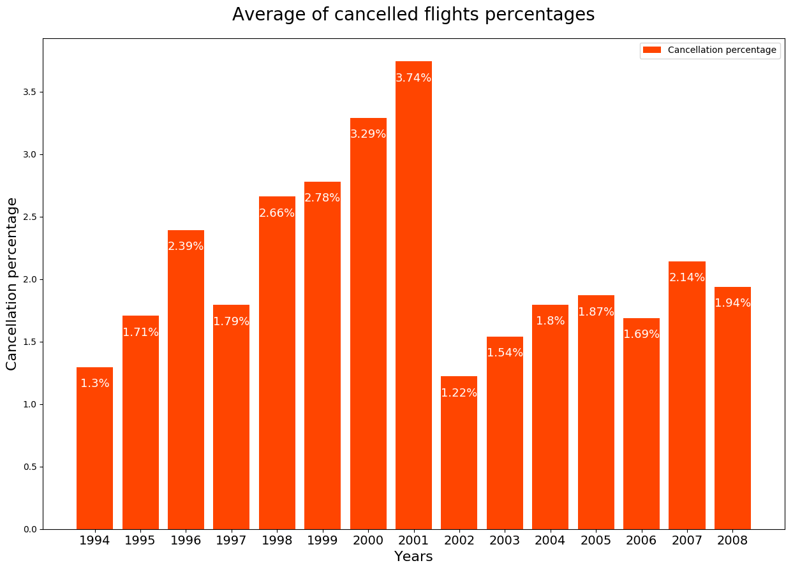
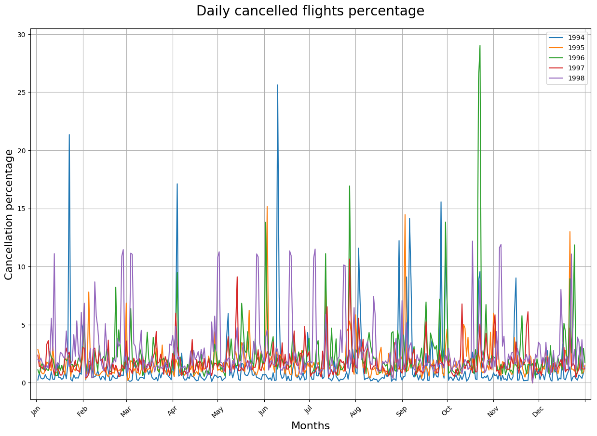
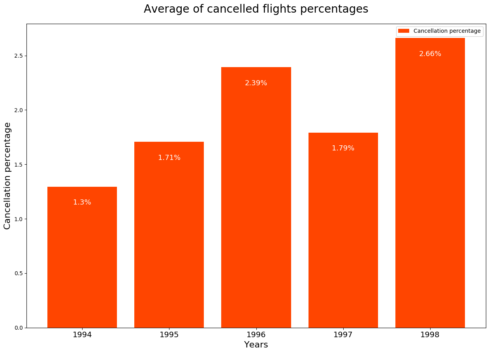
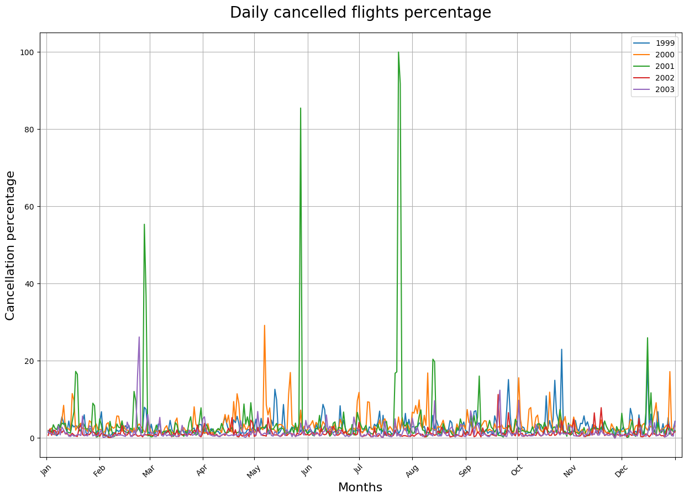
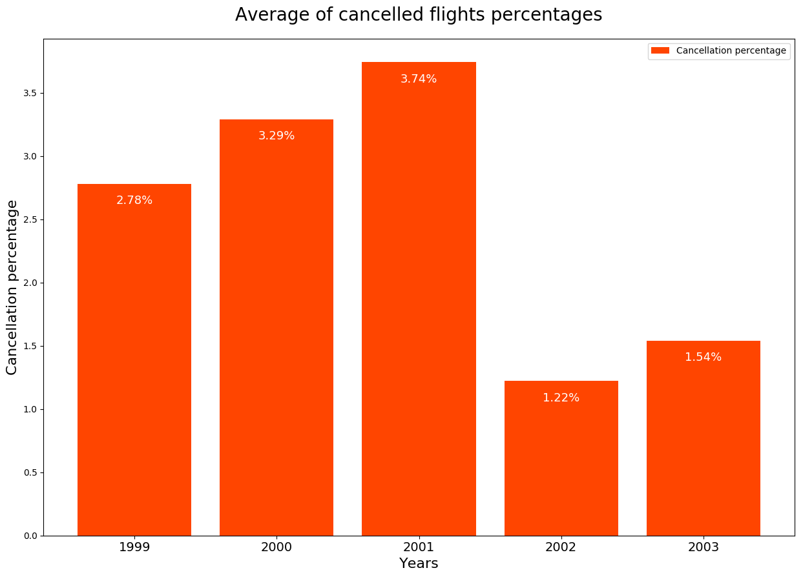
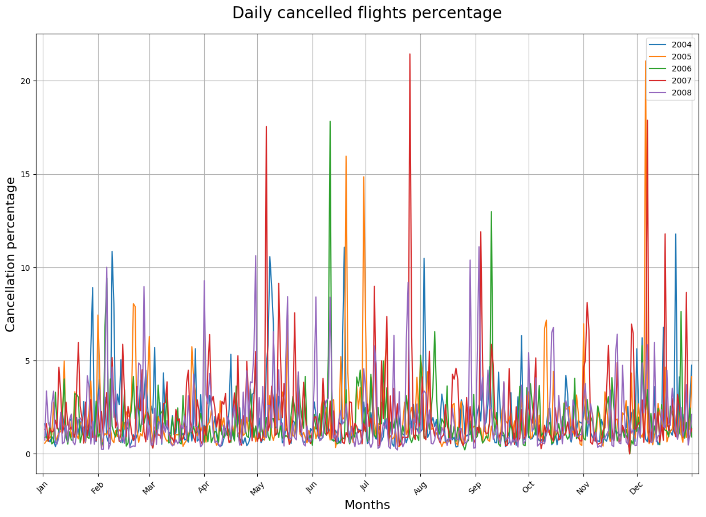
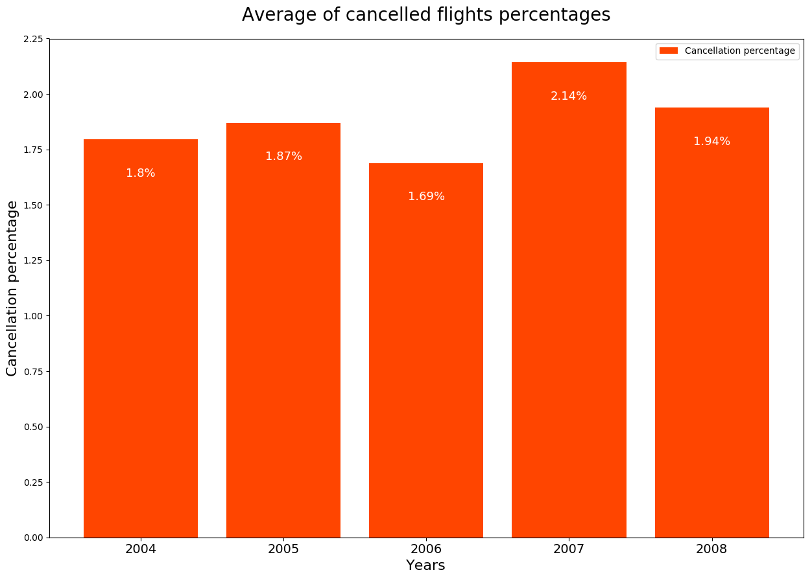

##### NOTICE

> This reports has the goal to show **some of the results**. It was **not** possible to export **all the feasible combinations** of analytics performed because they were too many.
>
> Moreover, most of the parts of the notebook containing code have been omitted.
>
> Please, have a look at the notebook corresponding to this report ([notebooks](../notebooks) folder) and run it to perform any desired combination of the analytics.


## **Airport daily percentage of cancelled flights**


In this notebook we compute the percentage of cancelled flights per day, throughout the entire data set.


## Data Visualization

Analytics showhing the percentage of daily cancelled flights are reported below.

### Missing values and valid data


```python
plot_missing_values_stacked_bar(df_missing)
```





### Percentage of daily cancelled flights

A line plot was used to display percentages as a time series. 

- _x axis_ is the day number, from day 1 (1st of January of the selected year) to 366 (30th of December of the selected year)
- _y axis_ reports the daily percentage of cancelled flights

Moreover, also bar plot is generated to display the yearly average of cancelled flights.


#### Data discoveries

- The analytics is performed over the totality of the data. There're no missing values for the analized attributes.


```python
out = widgets.interactive_output(ui_callback, {'years': years_w})
display(ui, out)
```

> Interactive widgets screenshot



> Examples of some possible outputs

##### 1994-2008




##### 1994-1998




##### 1999-2003




##### 2004-2008


