##### NOTICE

> This reports has the goal to show **some of the results**. It was **not** possible to export **all the feasible combinations** of analytics performed because they were too many.
>
> Moreover, most of the parts of the notebook containing code have been omitted.
>
> Please, have a look at the notebook corresponding to this report ([notebooks](../notebooks) folder) and run it to perform any desired combination of the analytics.


## **Airport weekly percentage of flights delayed due to weather over total delayed flights**

In this notebook we compute the weekly percentages of delays that are due to weather, throughout the entire data set.

The percentage is computed as the ratio between the number of flights with a weather delay and the total number of flights with a delay.

More formally:

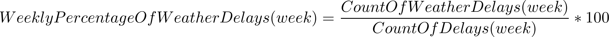

> 


> 

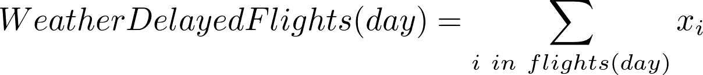

> 


> 


> 


### Assumptions

- Flights that have been cancelled are not considered in the percentage computation

## Data Visualization

Analytics for weekly percentage of flights delayed due to weather are reported below.

### Missing values and valid data


```python
plot_missing_values_stacked_bar(df_missing)
```


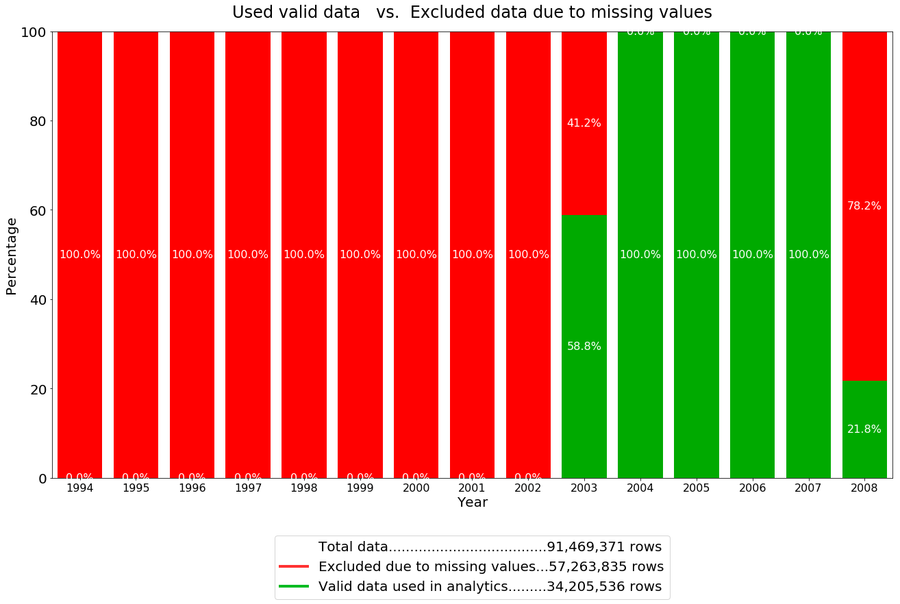


### Percentage of weekly delays due to weather

A line plot is used to display percentages as a time series.

- _x axis_ is week number
- _y axis_ reports weekly percentage of flights delayed due to weather

Moreover, a bar plot is chosen to display the yearly average weekly-percentage of flights with weather delays.


#### Data discoveries

- Before year 2003 the $WhetherDelay$ attribute is always 0. Probably this attribute was not being recorded bofore that year.
- After the first week of year 2003, there is an empty gap of 20 weeks for the $WhetherDelay$ attribute but then, after that, the attribute is preset.


```python
out = widgets.interactive_output(ui_callback, {'years': years_w})
display(ui, out)
```

> Interactive widgets screenshot

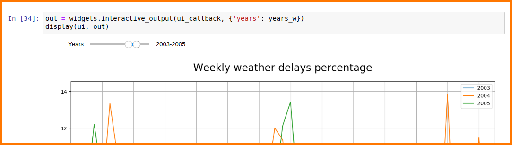

> Examples of some possible outputs

##### 1994-2008
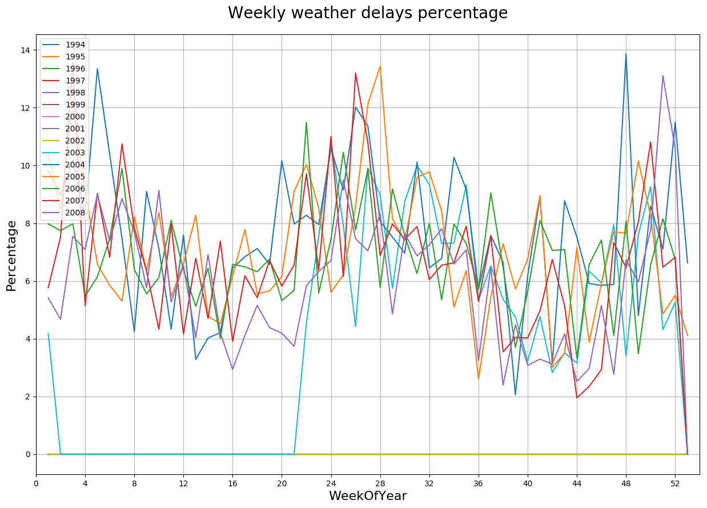
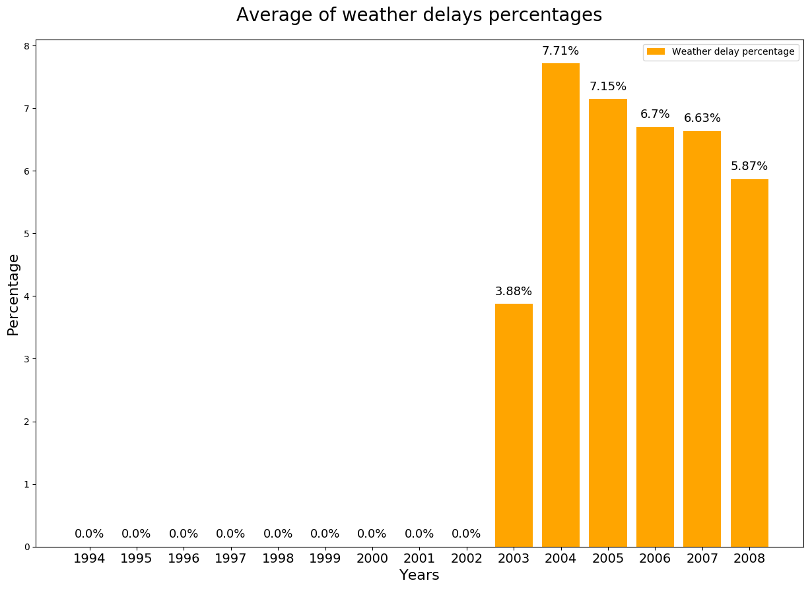


##### 1994-1998
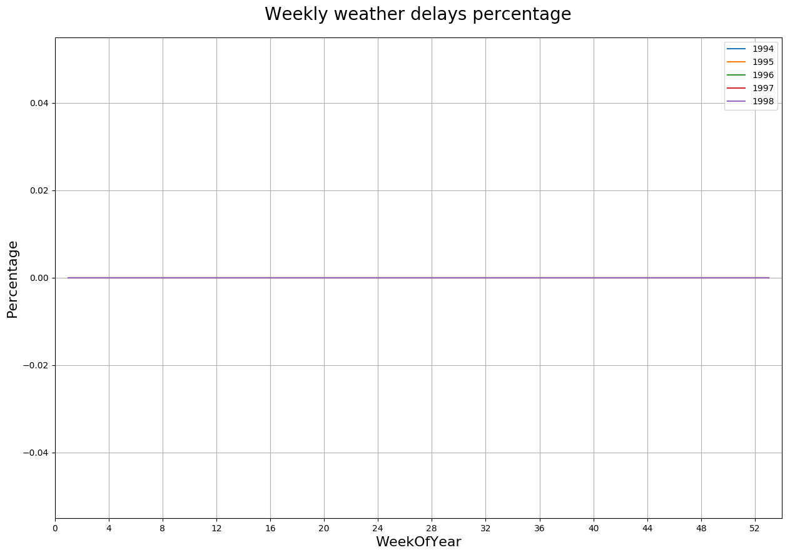
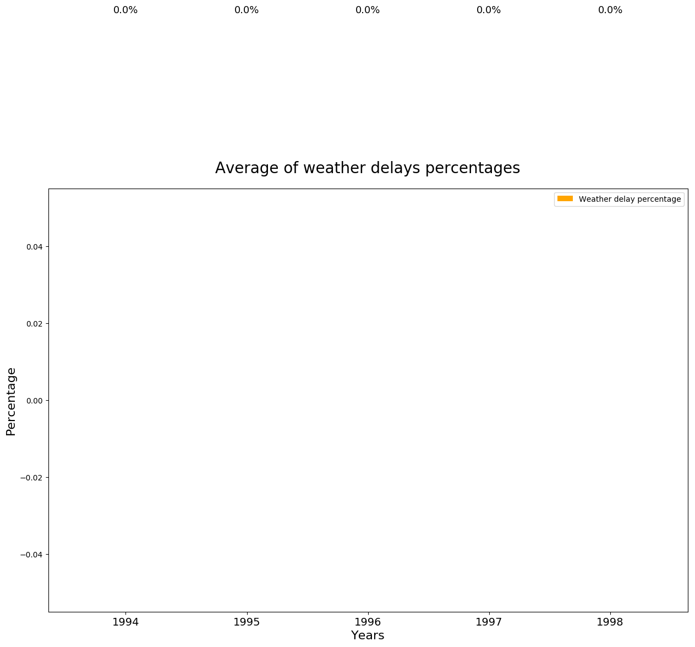


##### 1999-2003
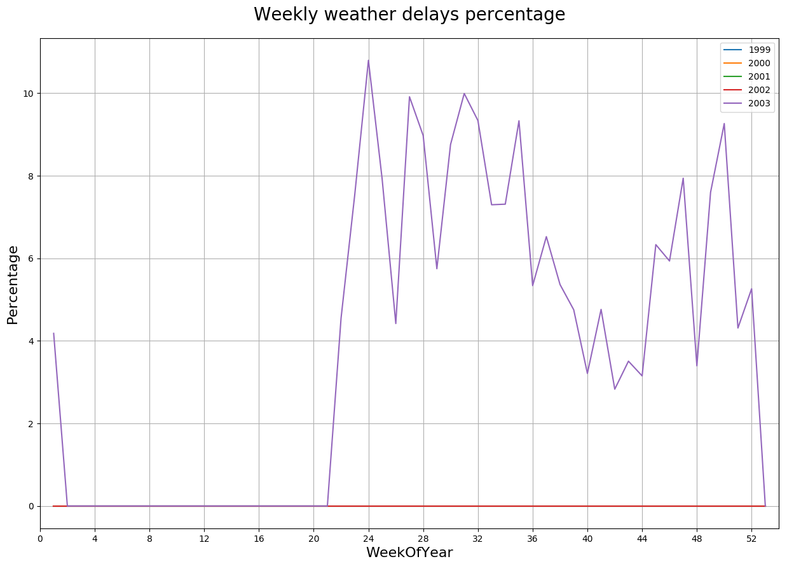
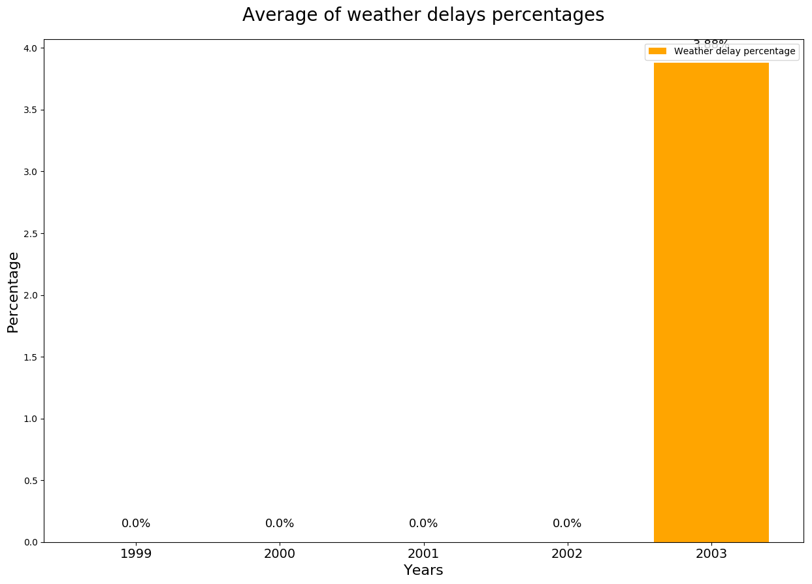


##### 2004-2008
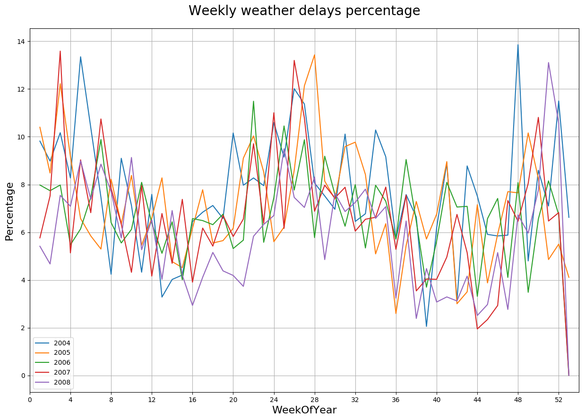
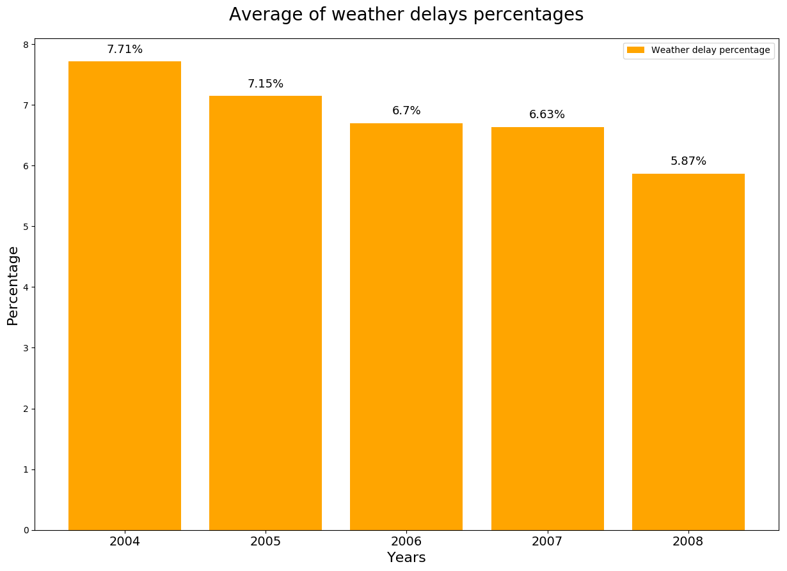
