##### NOTICE

> This reports has the goal to show **some of the results**. It was **not** possible to export **all the feasible combinations** of analytics performed because they were too many.
>
> Moreover, most of the parts of the notebook containing code have been omitted.
>
> Please, have a look at the notebook corresponding to this report ([notebooks](../notebooks) folder) and run it to perform any desired combination of the analytics.

# Percentages of flights belonging to a distance group that halved a delay

In this notebook we compute the percentage of flights belonging to a given "distance group" that were able to halve their departure delays by the time they arrived at their destinations. Distance groups assort flights by their total distance in miles. Flights with distances that are less than 200 miles belong in group 1, flights with distances that are between 200 and 399 miles belong in group 2, flights with distances that are between 400 and 599 miles belong in group 3, and so on. The last group contains flights whose distances are between 2400 and 2599 miles.


So basically:

- By the _Distance_ attribute we can infer the flight group:

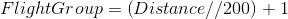

- For each flight we can say if it has halved or not its delay:

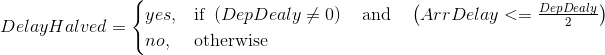

- So, for each flight group we can create two sets of flight: those that have halved their delays and the others

### Assumptions

- The last group, as the assignment states, is group ( 2599 // 200 ) + 1 = 13
- Each flight not belonging to a valid group is not considered

## Data visualization

Analytics for the percentage of flights belonging to a given "distance group" that were able to halve their departure delays are reported below.

## Data exluded from visualization

### Missing values and valid data


```python
plot_missing_values_stacked_bar(df_missing)
```


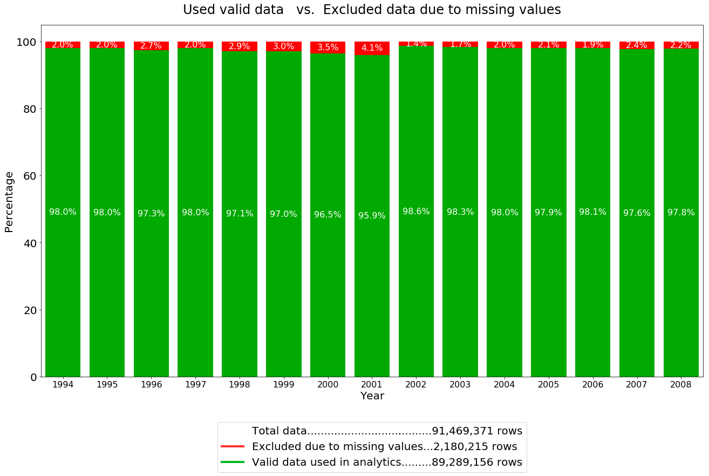


The following chart show the percentage of dropped rows due to missing values.


```python
show_missing_pie_chart()
```

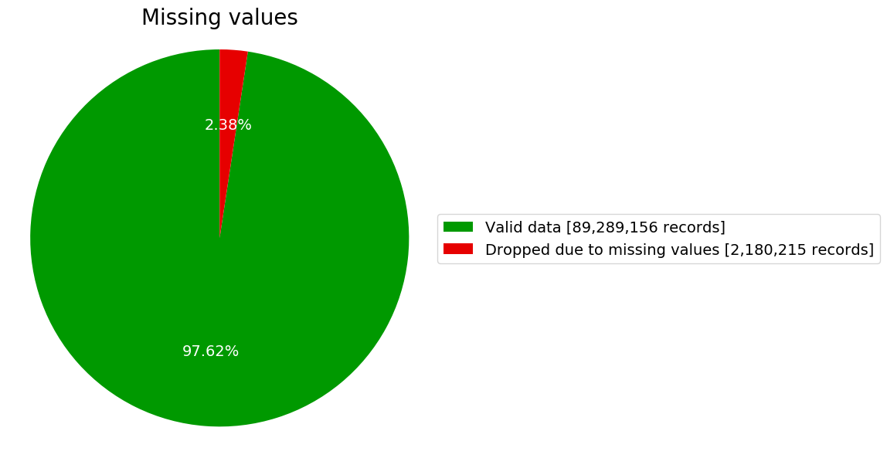


### Invalid group value

The following chart show the percentage of dropped rows due to group value exceeding the last valid group (13).


```python
show_group_invalid_pie_chart()
```

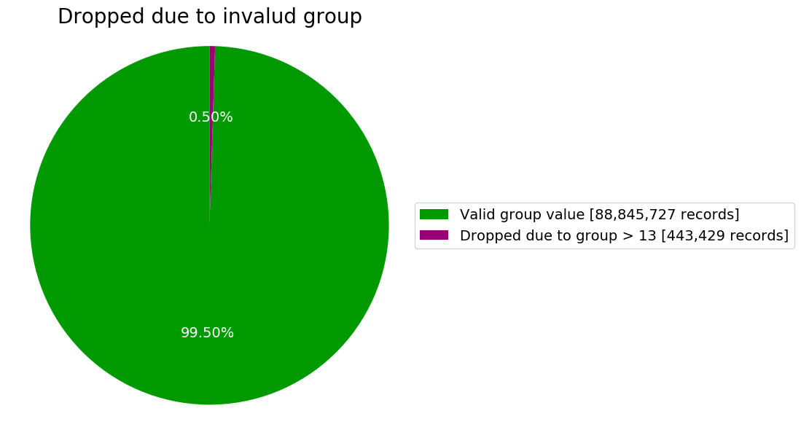


### Summary of excluded data

The following chart show the summary of dropped rows


```python
show_dropped_summary_pie_chart()
```

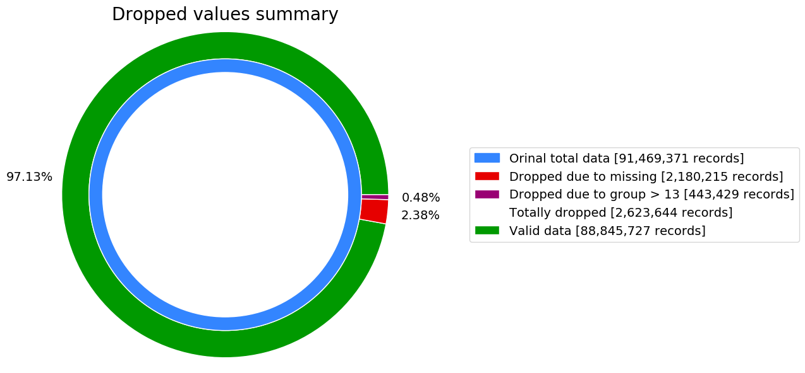


## Percentages of flights belonging to a distance group that halved a delay

### Delay per group

The following chart show the percentage of halved delay per group


```python
def ui_callback(group):
    global halved_delays
    show_group_halved_delays_pie_chart(halved_delays[group])
    
groups_w = widgets.Dropdown(options=halved_delays.keys(), 
                                  value=list(halved_delays.keys())[0],
                                  description='Group')

ui = widgets.HBox([groups_w])    
out = widgets.interactive_output(ui_callback, {'group': groups_w})

display(ui, out)
```

> Interactive widgets screenshot

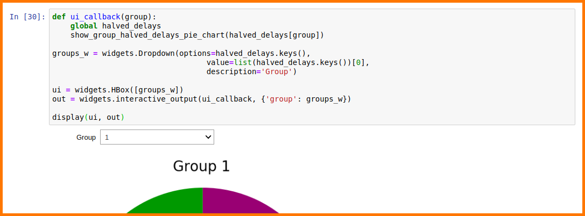

> Examples of possible outputs


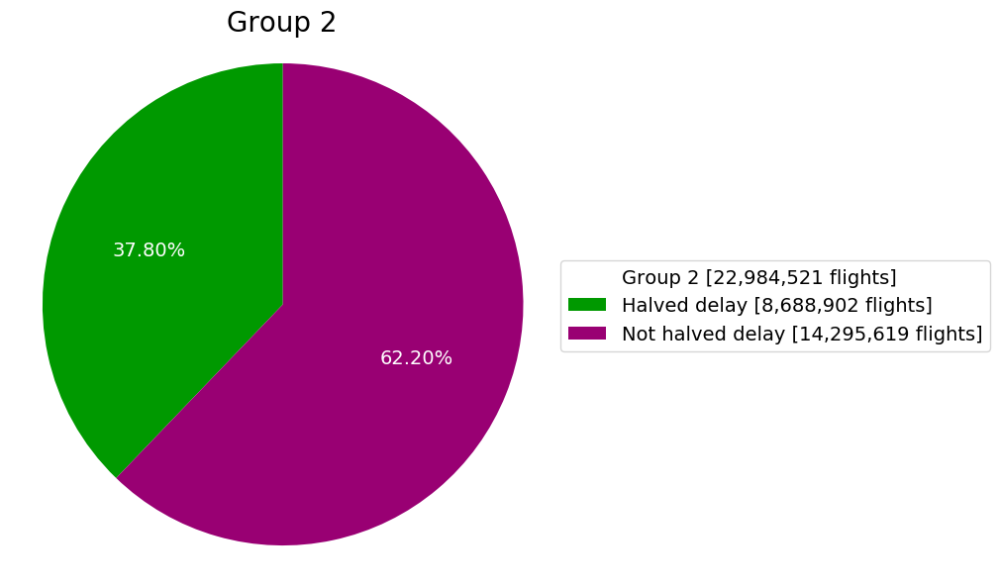


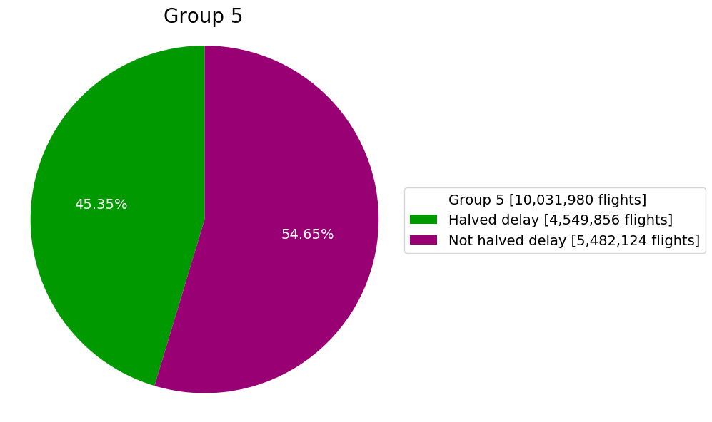

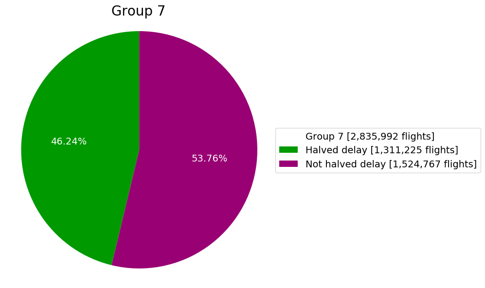


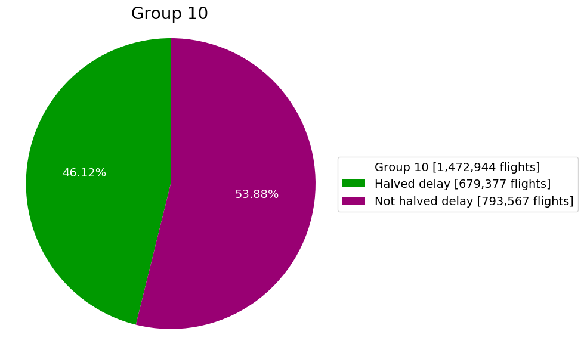

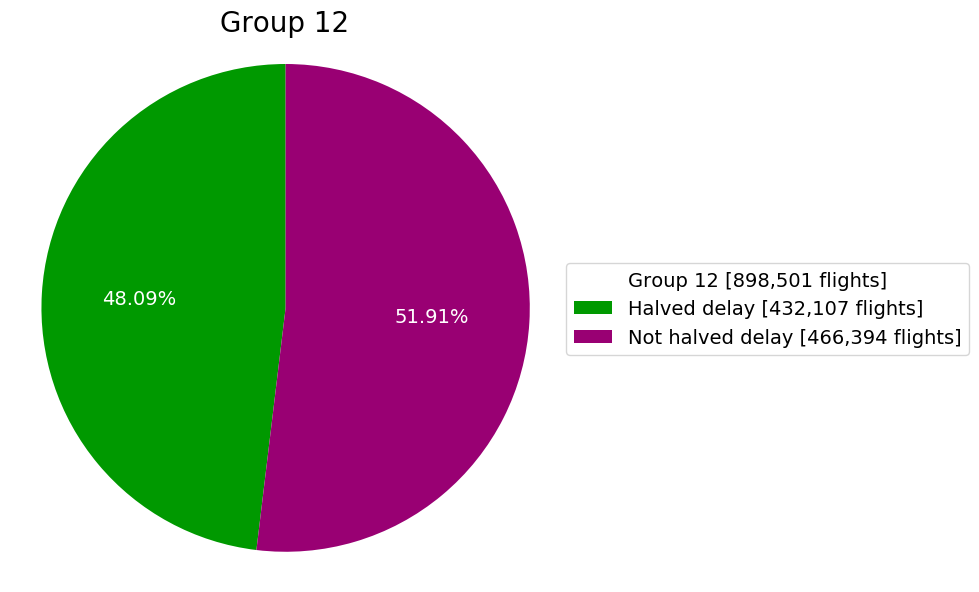
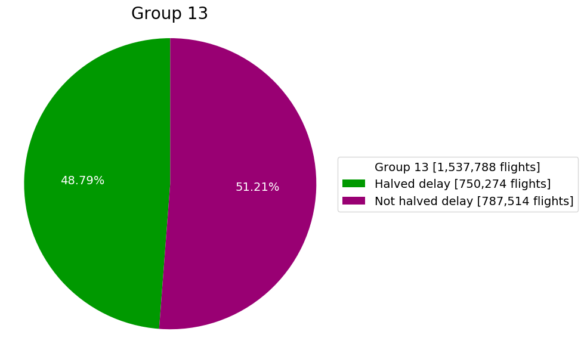


## Comparison of halved delay percentages

The following stack bar chart compares the percentages of halved delay for all groups


```python
show_percetages_comparison_horizontal_stack_chart()
```


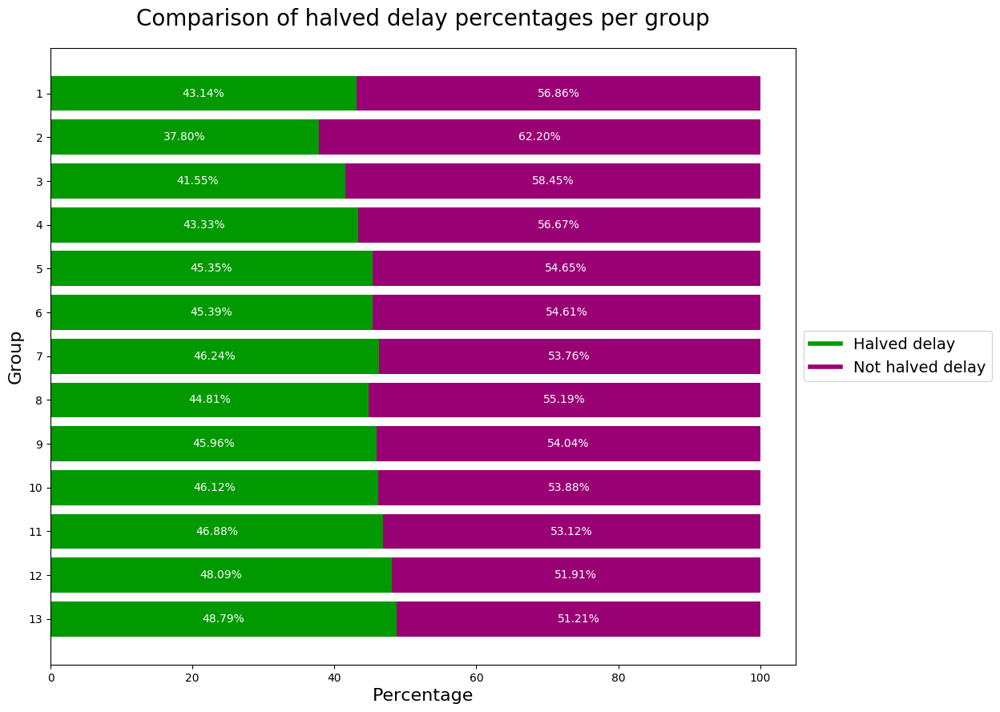

