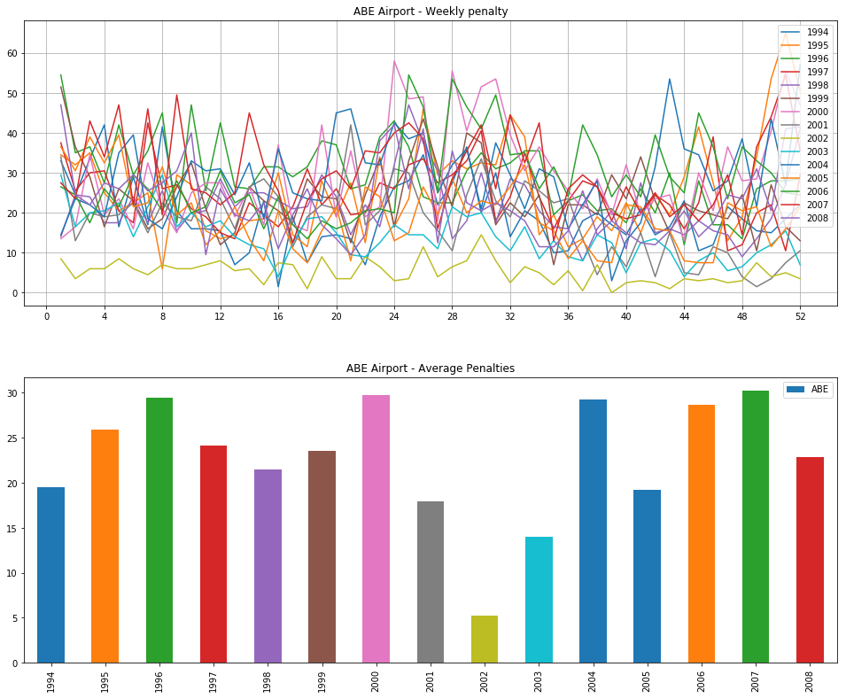

# Airport weekly penalty for arrivals and departures delays 

In this notebook we are computing a weekly "**penalty**" score for each airport that depends on both the its incoming and outgoing
flights. The score adds `0.5` for each incoming flight that is more than _15 minutes_ late, and `1` for
each outgoing flight that is more than _15 minutes_ late.

Formally speaking, let _w = {1, 2, ..., 52}_ be the _week number_ in a year _y_ and _f_ be a flight _leaving from_ or _arriving to airport_ on week _w_ of year _year_. Then we compute the weekly penalties as the following:

# Data Visualization

Analytics for airports weekly penalty are reported below.

A **line plot** is used to display penalties as a time series. On the `x` axis the week number is reported, while on the `y` axis we show the weekly penalty.

Moreover, a **bar plot** is chosen to display the *yearly average* weekly-penalty of a given airport.

> Since the produced charts would have been too many, they are dynamically generated in the notebook through the parameters chosen by the user.
>
> The followings **are samples** of the notebook _dynamically_ generated charts. Please, run the notebook to be able to select parameters of interest and so generate any chart.

