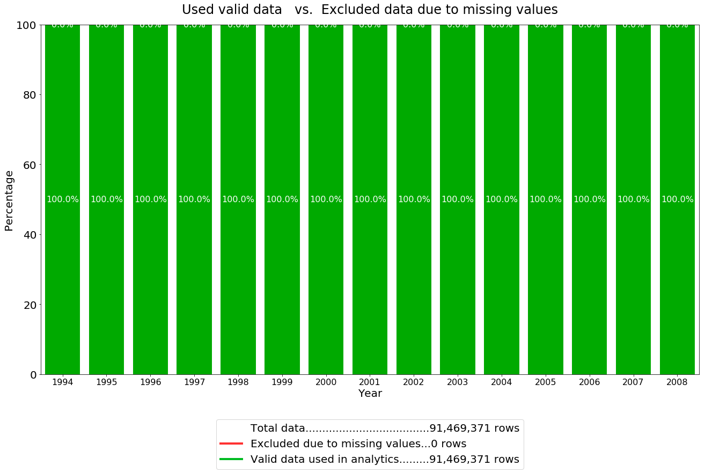
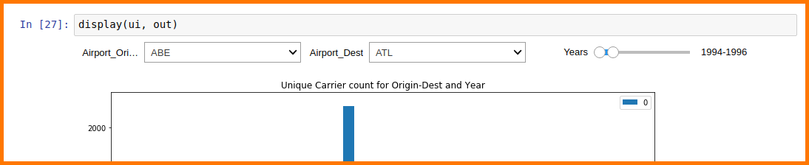
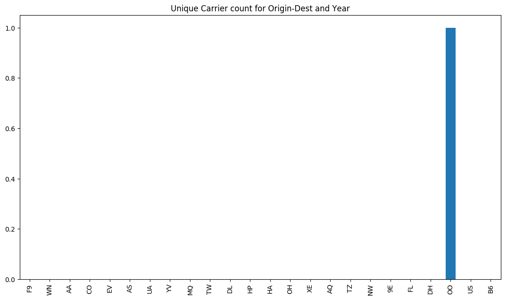
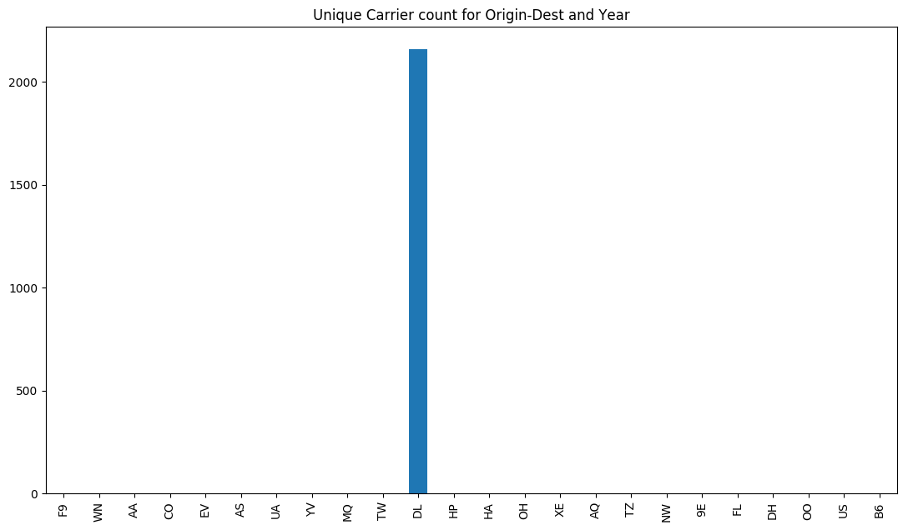
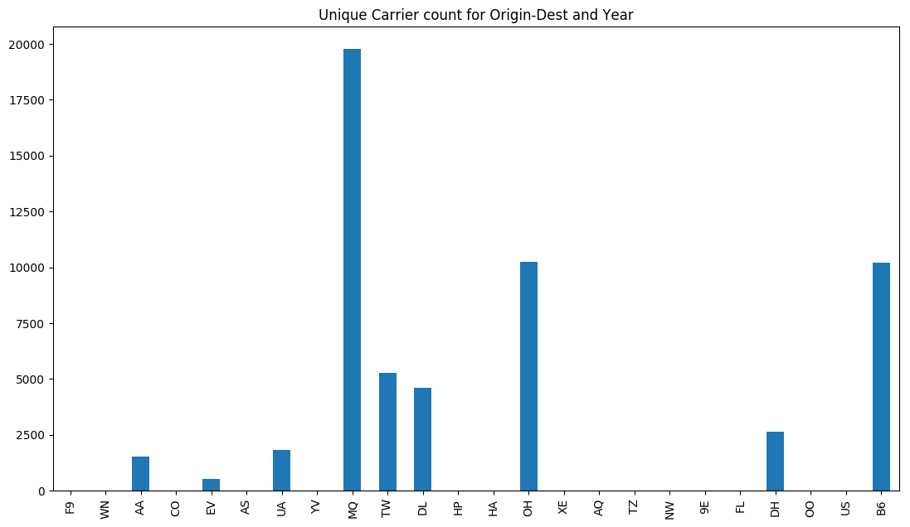
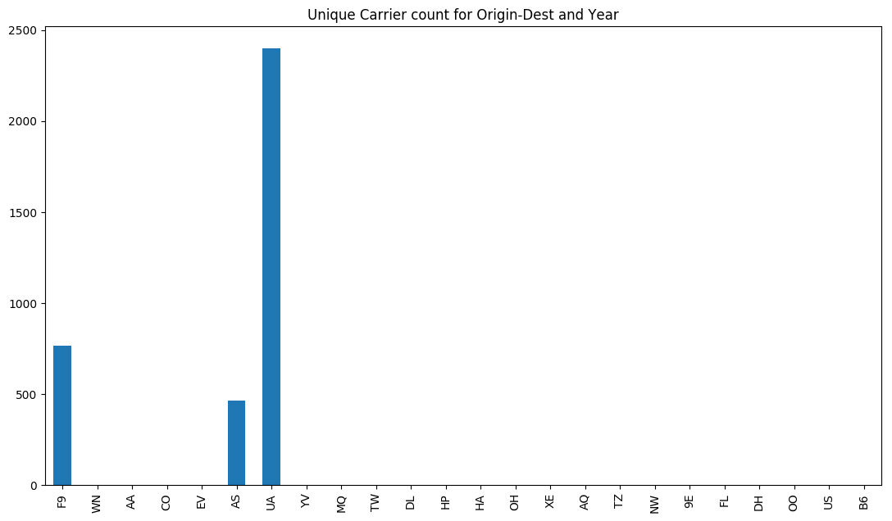
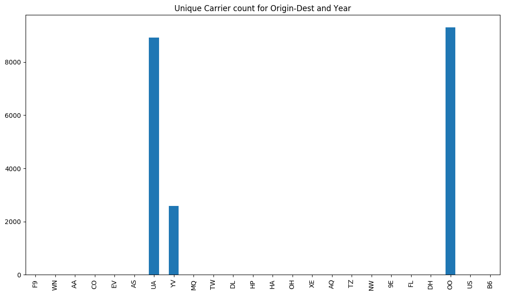

##### NOTICE

> This reports has the goal to show **some of the results**. It was **not** possible to export **all the feasible combinations** of analytics performed because they were too many.
>
> Moreover, most of the parts of the notebook containing code have been omitted.
>
> Please, have a look at the notebook corresponding to this report ([notebooks](../notebooks) folder) and run it to perform any desired combination of the analytics.


# Yearly number of carriers' flights provided for each origin-dest pair (route)

In this notebook we compute the yearly number of flights provided by the carriers for each route.

In the other notebooks other aspects of the dataset were analysed but no information about the carriers were inspected.


## Data Visualization

Analytics showhing yearly number of flights provided by the carriers for each route are reported below.

### Missing values and valid data


```python
plot_missing_values_stacked_bar(df_missing)
```




### Yearly number of flights provided by the carriers for each route

For the user convenience, the Aiport_Dest dropdown is automatically filled with only the airports that are valid destinations with respect to the selected Airport_Origin. Change the Airport_Origin value to update the Aiport_Dest dropdown.

> **WARNING**
>
>If the resulting chart is empty, it means that for the selected years that are no flights. In this case, by selecting all the available years, at least one bar will be visualized.


#### Data discoveries

We decided to keep the absolute value of flights managed by each carrier and not to show the percentage w.r.t. the totality of flights on the route because we noticed a very high variance of the possible results. Some routes are much more covered than others.

#### Suggested tests
- ABE-AZO: 1 flight only (2006)
- ABE-ATL interesting before/after 2000
- DEN-ABE
- DEN-COS
- BOS-JFK

List of airports in the United States: https://en.wikipedia.org/wiki/List_of_airports_in_the_United_States
<br/>List of airline codes: https://en.wikipedia.org/wiki/List_of_airline_codes


```python
display(ui, out)
```

> Interactive widgets screenshot



> Examples of some possible outputs

##### ABE-AZO 1994-2008


##### ATE-ATL 1994-1996


##### BOS-JFK 1994-2008


##### DEN-ANC 1994-2008


##### DEN-COS 2000-2008

